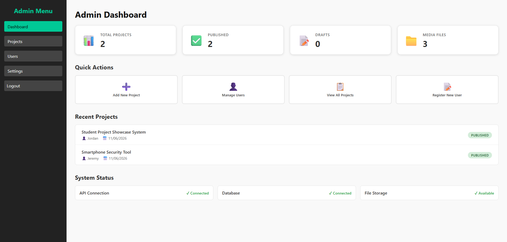
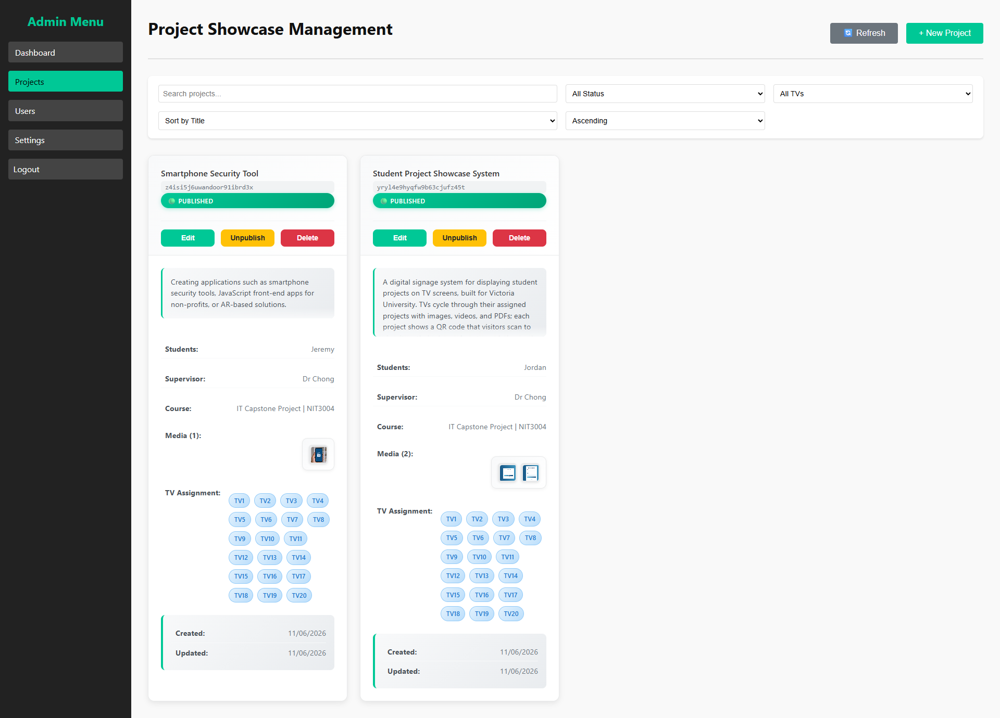
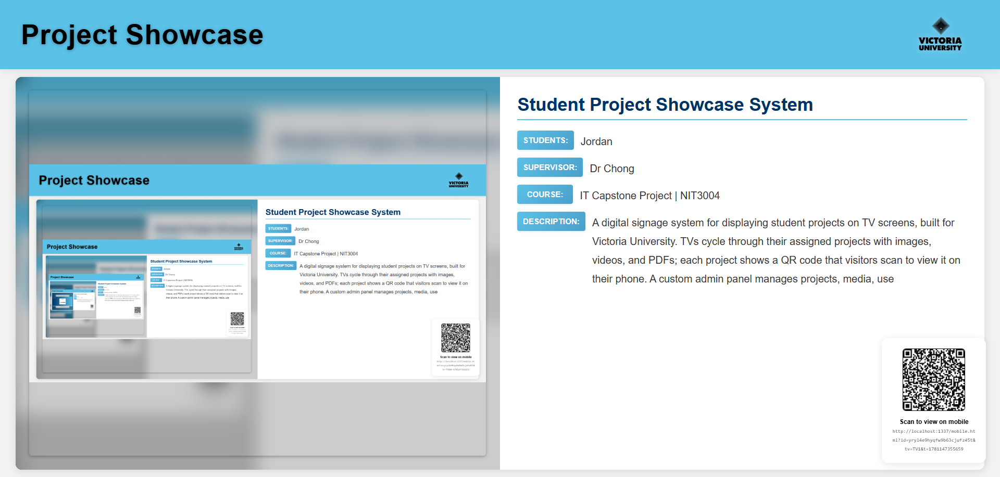
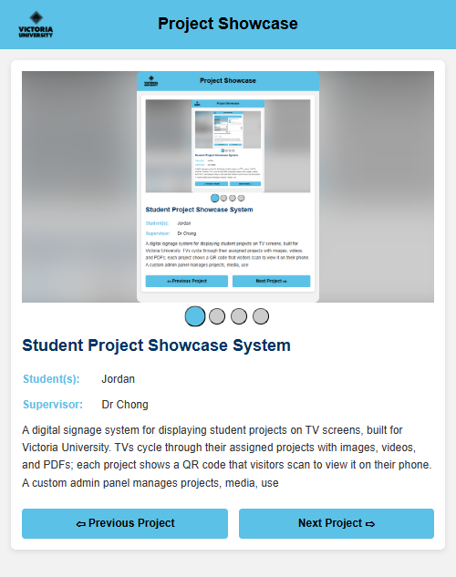
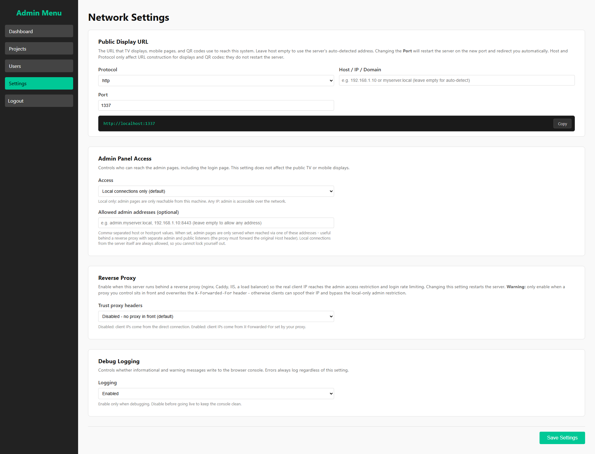
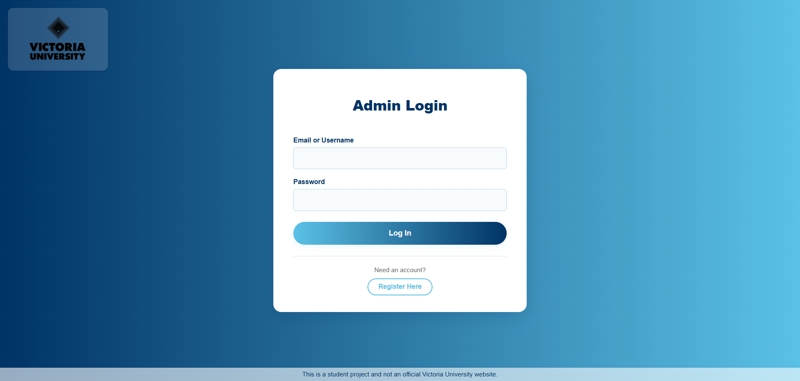

<p align="center">
  
</p>

<h1 align="center">Project Showcase System</h1>

<p align="center">
  A digital-signage platform that turns any set of TVs into a live, self-updating
  showcase of student work: each screen cycles published projects with a QR code
  that opens the same project on a visitor's phone.
</p>

<p align="center">
  <strong>Full-stack</strong> | Strapi 5 | Node.js | TypeScript | Vanilla-JS frontend | SQLite | Cookie auth | Docker | Reverse-proxy ready
</p>

<p align="center"><sub>Solo capstone project | Victoria University | 2025-2026</sub></p>

---

## Overview

**Project Showcase System** is a capstone project built for Victoria University. The
brief: let staff publish student projects from one admin panel and have them appear
automatically across a fleet of display TVs, with a frictionless path for passers-by
to explore a project in depth on their own phone.

A single Node.js/Strapi server does everything: the REST API, a custom admin panel,
the public TV and mobile pages, and media storage. The whole system deploys as one
process on a small box (it runs on an Intel NUC kiosk). Non-technical operators
configure it entirely through a settings page; there are no config files to edit and
no separate services to wire up.

> **A note on the code:** this repository is a case study. The full implementation
> lives in a private repository.

---

## Screenshots

| Admin dashboard | Projects and media management |
|---|---|
|  |  |

| TV display (with live QR) | Mobile view (QR target) |
|---|---|
|  |  |

| Runtime settings (no code edits) | Login |
|---|---|
|  |  |

---

## How it works

```
 Editor / Super Admin                         Visitors
        |                                         |
        v                                         v
 /vu-admin  (custom admin panel)         TV screens, one URL each
 create project, upload media,   ----->  /tv?tv=TV1 ... TV20
 assign to TVs, publish                  cycling that TV's published projects
                                                 |
                                          a QR code per project,
                                          regenerated on every change
                                                 |
                                                 v
                                         /mobile?id=...
                                         phone view: touch carousel,
                                         lightbox, prev/next navigation
```

One Strapi server (default port 1337) serves the backend API, the admin panel, the
TV pages, the mobile pages, and uploaded media. Each physical TV runs a browser
pointed at its own URL; projects are assigned to one or more TVs, and only published
projects ever reach a screen.

---

## Key features

- **Self-updating TV displays.** Each TV cycles its assigned published projects.
  Images share a fixed slot, videos play to their own length, and PDFs are expanded
  into one slide per page (rendered client-side with PDF.js). The QR code regenerates
  on every project change.
- **Scan-to-phone mobile view.** A QR scan opens the current project on the
  visitor's phone with a touch carousel, image lightbox, video controls, and
  next/previous navigation between projects.
- **Custom admin panel.** Project CRUD with drag-and-drop upload, live media
  preview, drag-to-reorder, a draft/publish workflow, and client + server validation.
- **Role-based access.** Super Admin and Editor can sign in; new registrations land
  in a Pending role until a super admin approves them.
- **Zero-code configuration.** Public URL, admin-access restrictions, reverse-proxy
  trust, and logging are all set from a settings page that writes to a runtime config
  file. Changes apply live, with an automatic restart and redirect for the few settings that need one.
- **One-command, cross-platform setup.** Installer scripts detect and install a
  supported Node version (NodeSource/nvm on Linux/macOS, winget on Windows), then run
  an idempotent setup that generates secrets, installs, vendors PDF.js, and builds.

---

## Architecture

```
                         +-------------------------------------------+
                         |      Single Strapi 5 / Node.js server     |
                         |                                           |
  Admin browser  ------->|  /vu-admin    custom admin panel (static) |
  (local/proxy)          |  /api/*       REST API (project, auth,    |
                         |               network-config, server-info)|
  TV browsers    ------->|  /tv          public display pages        |
  Phones (QR)    ------->|  /mobile      public mobile pages         |
                         |  /uploads/*   media on disk               |
                         |                                           |
                         |  SQLite (better-sqlite3), files on disk   |
                         +-------------------------------------------+
```

- **One origin for everything.** API, admin, public pages, and media are served from
  the same Strapi instance, which keeps deployment to a single process and avoids
  cross-origin complexity. A small browser-side router resolves asset URLs against the
  page's own origin so the system works identically on localhost, a LAN IP, or behind
  a reverse-proxy hostname.
- **Cookie-based auth.** Authentication is an httpOnly JWT cookie paired with a
  readable CSRF token; a middleware bridges the cookie into the Bearer header Strapi
  expects. No tokens are ever exposed to JavaScript or stored in localStorage.
- **Optional-auth on public reads.** Public display routes run unauthenticated but
  still recognise a logged-in admin (so admins can preview drafts) via a custom
  optional-auth resolver, rather than duplicating route logic.
- **Reverse-proxy and tunnel aware.** Because the app gates the sensitive surface by
  origin itself, the public displays can be exposed directly, via a split-port reverse
  proxy (example nginx and Caddy configs included), or through a Cloudflare Tunnel with
  no open inbound ports. Admin stays reachable only from the campus network.

---

## Engineering highlights

The parts I'm most proud of are the ones that don't show up in a screenshot.

### Security, treated as a first-class requirement
- **httpOnly cookie auth + CSRF.** Credentials never touch JavaScript; every
  state-changing request requires a matching CSRF header.
- **Sessions die on restart.** Each JWT carries the server instance ID and is
  rejected after a restart, so a process bounce invalidates every outstanding session
  by default. Token lifetime is capped to one hour (down from Strapi's 30-day default).
- **Secure-cookie flag auto-derived** from the actual request transport, so HTTP and
  HTTPS deployments both work with zero configuration and no foot-guns.
- **Role allowlist, not denylist.** Admin access is granted by an explicit role
  allowlist shared between front and back end, closing the gap where a new or renamed
  role silently gains access.
- **One origin policy guards the whole admin surface.** A single shared gate
  restricts the admin panel, *every* state-changing API call, and the built-in CMS to
  admin origins (the server box, the LAN, or an explicitly allow-listed host), so the
  public TV/mobile displays can be served on the open internet while login,
  registration, and all writes stay unreachable from it. A host-based rule keeps admin
  off the public hostname even if a proxy/tunnel forwards headers incorrectly.
- **Defence in depth.** Per-IP plus per-identifier login rate limiting; a strict
  Content-Security-Policy; server-side MIME allow-listing on uploads; SVGs forced to
  download (stored-XSS prevention); path-traversal guards; and an endpoint that
  refuses to leak the admin security posture to anonymous callers.

### Built so a non-developer can deploy it
- **One command, any OS.** install.sh / install.ps1 detect the Node version and
  install a supported one when it's missing or too old: system-wide via NodeSource
  (or per-user via nvm) on Linux, winget on Windows.
- **Or one Docker command.** A multi-stage image pins Node and bundles the build, so
  the host needs only Docker; `docker compose up -d` generates secrets on first run,
  persists data in volumes, and uses the restart policy in place of a process manager.
- **Idempotent setup** that generates fresh secrets, installs dependencies, vendors
  PDF.js, and builds the panel. Safe to re-run, skipping any completed step.
- **Everything operational is a setting**, not a code edit: public URL, ports, proxy
  trust, admin access, and logging all live behind the settings page.

### Engineering challenges
A few problems that took real diagnosis to get right, each solved at the root rather
than patched at the symptom:

- **Public displays, private admin, one server.** Putting the displays on the
  internet would have exposed the entire API (including login and registration)
  because only the admin *pages* were origin-restricted, not the API behind them. I
  extracted that page gate into a single shared policy and applied it to the
  state-changing API and the built-in CMS as well, added a host rule that keeps admin
  off the public hostname even when proxy headers are wrong, and a LAN allowance so
  staff still administer from the campus network. The displays go public on one
  shared policy; admin never leaves the building.
- **Same-origin asset resolution.** Pages opened on 127.0.0.1 were fetching their
  assets from the configured localhost hostname, which the browser treats as a
  separate origin, so CSP blocked them. I fixed it at the source: any request to the
  page's own port resolves to the page's own origin, so the system behaves
  identically on localhost, a LAN IP, or behind a proxy hostname.
- **Auth-aware public endpoints.** The public read routes run unauthenticated, which
  meant an admin couldn't preview their own unpublished drafts. Rather than fork the
  routes, I added an optional-auth resolver that recognises a logged-in admin on an
  otherwise-public endpoint, keeping a single code path.
- **Cross-platform deployment.** Moving the project between a Windows dev machine and
  a Linux display box brings wrong-platform native binaries and drops executable
  bits. The installer now detects an unusable dependency tree and rebuilds it for the
  current platform automatically, so a non-developer never has to.

---

## Tech stack

| Layer | Technology |
|---|---|
| Backend / API | Strapi 5 (headless CMS on Node.js), TypeScript |
| Database | SQLite via better-sqlite3 (Postgres/MySQL supported via env) |
| Frontend | Vanilla JavaScript ES modules, HTML, CSS, no framework |
| Auth | httpOnly JWT cookie + CSRF token, role-based access control |
| Media | On-disk storage, client-side PDF rendering (PDF.js) |
| Tooling / deploy | Docker (multi-stage image + compose), Node bootstrap installers, reverse-proxy configs (nginx, Caddy) |

---

<p align="center"><sub>
Case study for a private project.
</sub></p>
