<p align="center">
  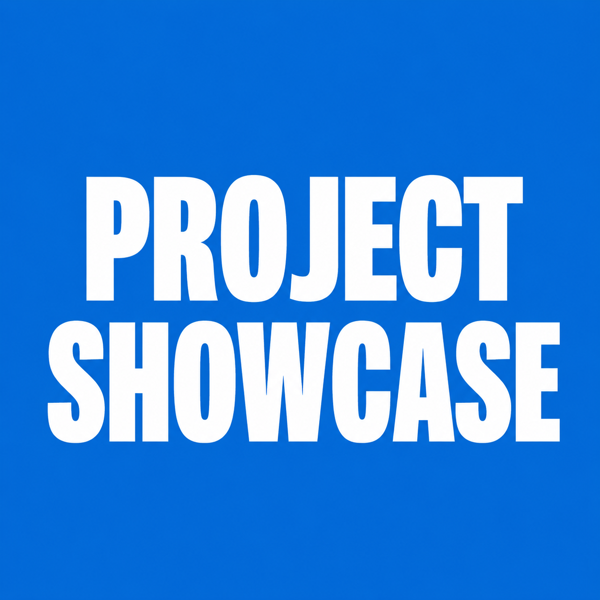
</p>

<h1 align="center">Project Showcase System</h1>

<p align="center">
  A digital-signage platform that turns any set of TVs into a live, self-updating
  showcase of student work. Each screen cycles its published projects with a QR code
  that opens the same project on a visitor's phone.
</p>

<p align="center">
  
  
  
  
  
  
</p>

<p align="center"><sub>Solo capstone project | Victoria University | 2025-2026</sub></p>

<p align="center">
  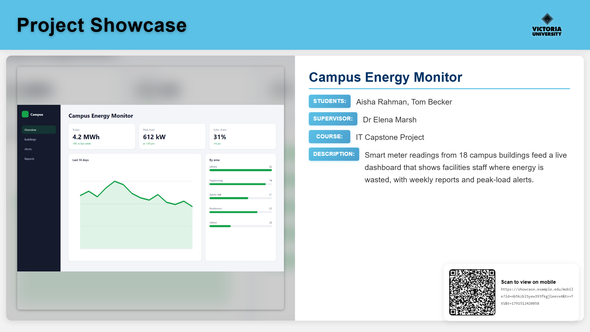
</p>

> **A note on the code:** this repository is a case study. The full implementation
> lives in a private repository. The screenshots use made-up example projects.

---

## Overview

**Project Showcase System** is a capstone project built for Victoria University. The
brief: let staff publish student projects from one admin panel and have them appear
automatically across a fleet of display TVs, with an easy path for passers-by to
explore a project in depth on their own phone.

A single Node.js/Strapi server does everything: the REST API, a custom admin panel,
the public TV and mobile pages, and media storage. The whole system deploys as one
process on one small machine, natively or in Docker. Day-to-day operation never needs
a config file: the public address, admin access rules, proxy trust, and logging all
live on a settings page.

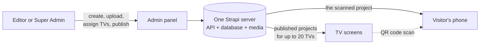
```mermaid
flowchart LR
    staff["Editor or Super Admin"] -->|"create, upload,<br/>assign TVs, publish"| admin["Admin panel"]
    admin --> server[("One Strapi server<br/>API + database + media")]
    server -->|"published projects<br/>for up to 20 TVs"| tv["TV screens"]
    server -->|"the scanned project"| phone["Visitor's phone"]
    tv -.->|"QR code scan"| phone
```

---

## Key features

- **Self-updating TV displays.** Each TV cycles its assigned published projects and
  re-checks the list every minute, so publishing or unpublishing reaches every screen
  without anyone touching a TV. Still images split each project's time slot evenly
  (within sensible per-image limits), videos play to their own length, and PDFs are
  rendered in the browser as one slide per page. Screens start a few seconds apart so a
  wall of TVs never changes in lockstep.
- **Screens that look after themselves.** The 2018 Samsung TVs run a small app that
  opens the showcase full-screen, and the server checks every screen every 30 seconds:
  a TV that was switched off is woken over the network, and one showing anything else
  is put back on the showcase. Staff see each screen's live status, location and TV
  number on a TV Screens page, a screen follows a new TV number within a minute, and
  after an update every screen reloads itself. The TV page also runs on those TVs'
  2018-era browser, and needs no internet, only the local network.
- **Scan-to-phone mobile view.** A QR scan opens the current project on the visitor's
  phone with a swipeable carousel, full-screen image viewer, video audio controls, and
  next/previous navigation between projects.
- **Custom admin panel.** Project management with drag-and-drop uploads that start
  immediately, live media previews, drag-to-reorder, a draft/publish workflow with a
  confirmation step, a student-consent check before anything is published, and
  validation that mirrors the server's rules. Large selections upload in batches, and abandoned drafts clean
  themselves up.
- **Role-based access.** Super Admins and Editors can sign in; new registrations wait
  in a Pending role until a Super Admin approves them, and every admin can change
  their own password from a My Account page.
- **Zero-code configuration.** Public address, admin-access rules, reverse-proxy trust,
  and logging are set from a settings page. Changes apply live, with an automatic
  restart and redirect for the two settings that need one.
- **One-command, cross-platform setup.** Installer scripts detect and install a
  supported Node version, then run an idempotent setup that generates secrets and a
  unique admin password, installs dependencies, and builds. Docker is a one-line
  alternative.

---

## Screenshots

### Public displays

| TV display, with a live QR code | Mobile view (the QR target) |
|---|---|
|  | 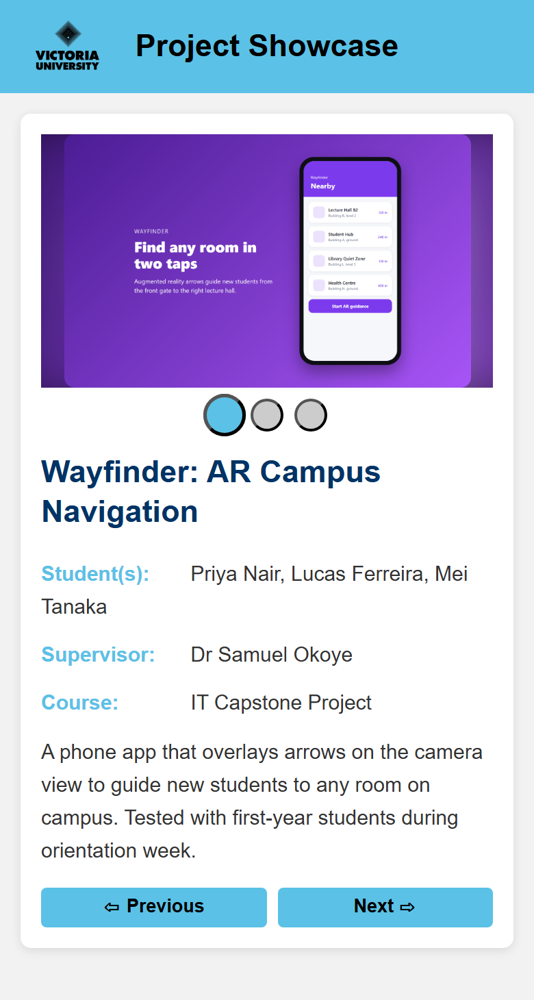 |

### Admin panel

| Dashboard | Projects and media management |
|---|---|
| 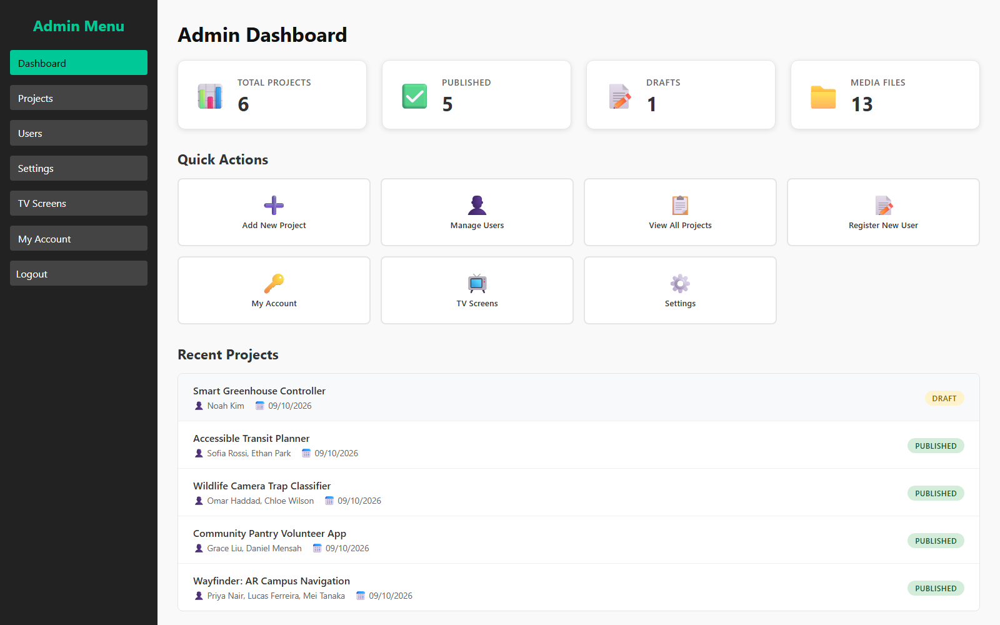 | 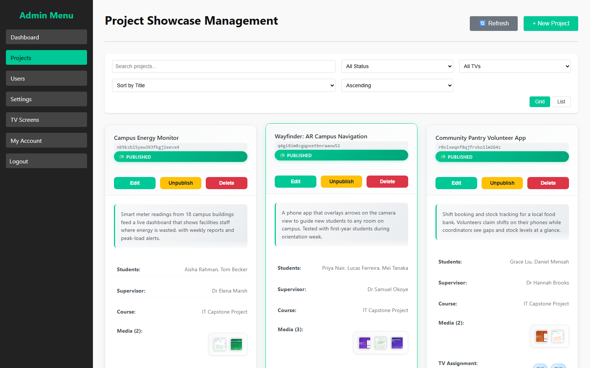 |

| Project editor | User approval and roles |
|---|---|
| 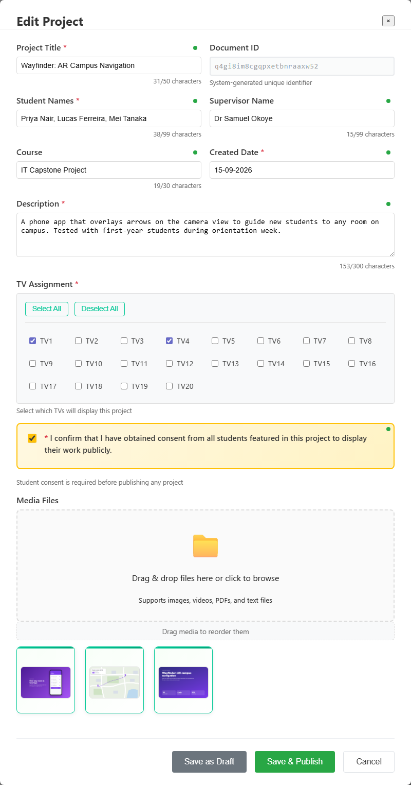 | 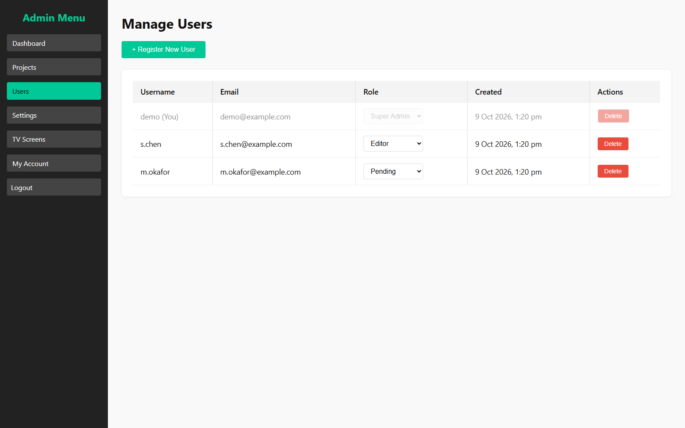 |

| Runtime settings, no code edits | TV screens, with live status |
|---|---|
| 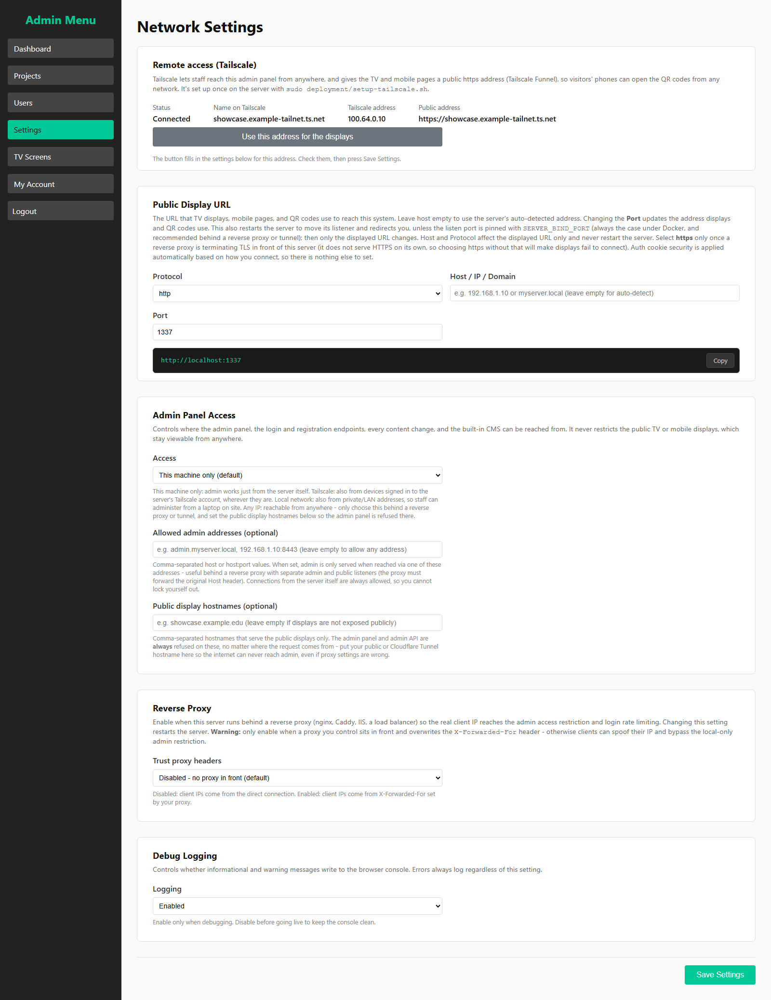 | 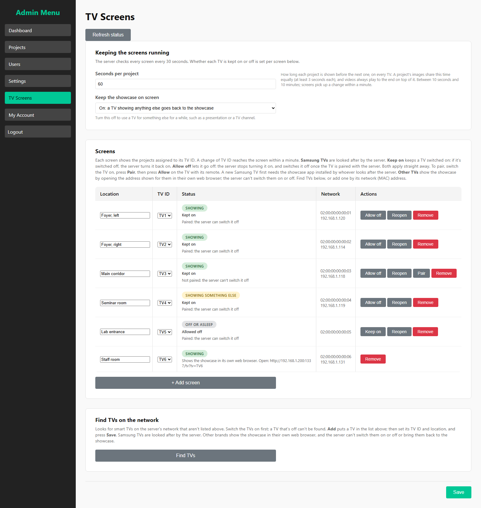 |

| Sign in and registration |
|---|
| 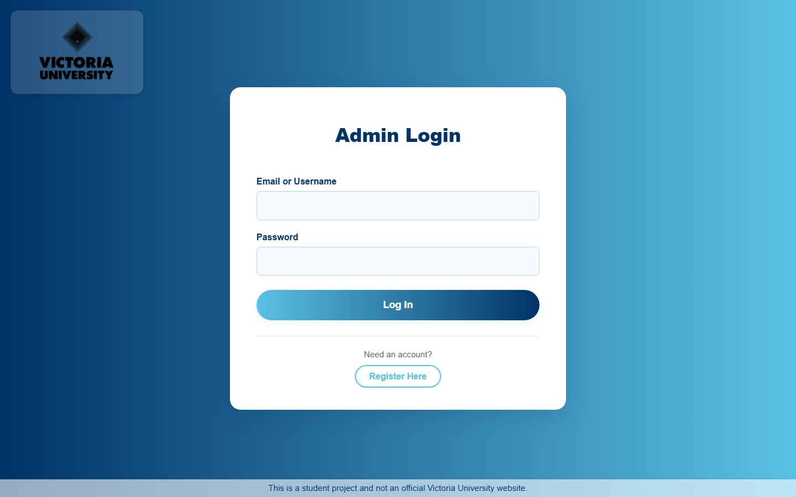 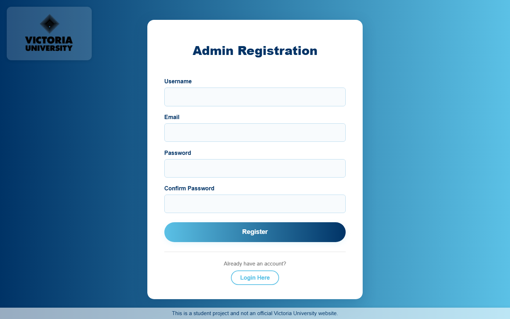 |

---

## How a project reaches a screen

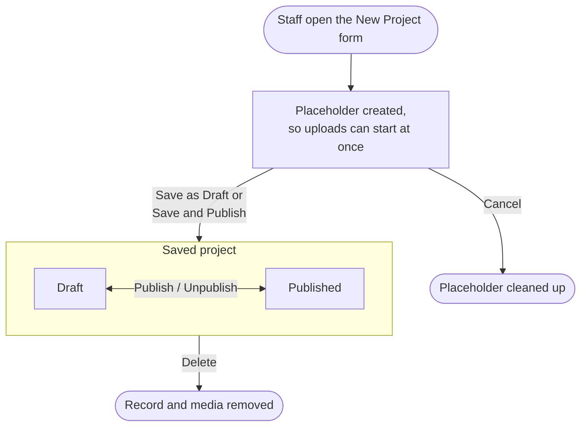
```mermaid
flowchart TD
    open(["Staff open the New Project form"]) --> placeholder["Placeholder created,<br/>so uploads can start at once"]
    placeholder -->|"Cancel"| removed(["Placeholder cleaned up"])
    placeholder -->|"Save as Draft or<br/>Save and Publish"| saved
    subgraph saved["Saved project"]
        direction LR
        draft["Draft"] <-->|"Publish / Unpublish"| published["Published"]
    end
    saved -->|"Delete"| deleted(["Record and media removed"])
```

Only published projects ever reach a screen or a phone. Anonymous visitors can't
see drafts, even by guessing a project's address.

---

## Architecture

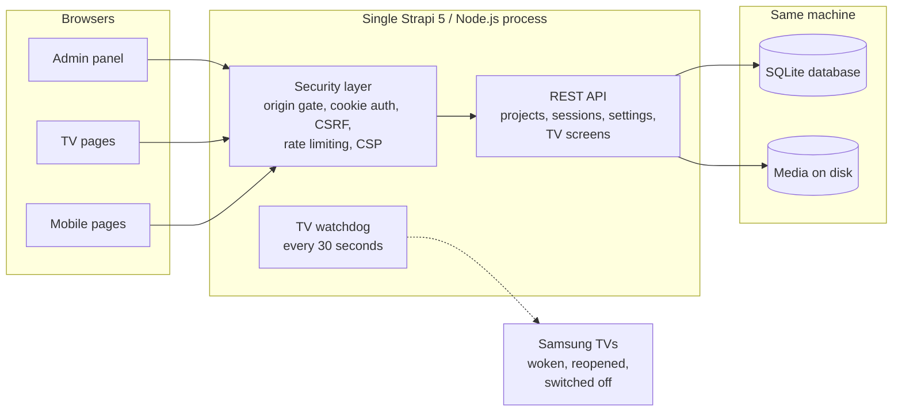
```mermaid
flowchart LR
    subgraph browsers["Browsers"]
        direction TB
        adminui["Admin panel"]
        tvui["TV pages"]
        mobileui["Mobile pages"]
    end
    subgraph server["Single Strapi 5 / Node.js process"]
        direction TB
        mw["Security layer<br/>origin gate, cookie auth, CSRF,<br/>rate limiting, CSP"]
        api["REST API<br/>projects, sessions, settings,<br/>TV screens"]
        watchdog["TV watchdog<br/>every 30 seconds"]
    end
    samsung["Samsung TVs<br/>woken, reopened,<br/>switched off"]
    subgraph storage["Same machine"]
        direction TB
        db[("SQLite database")]
        media[("Media on disk")]
    end
    adminui --> mw
    tvui --> mw
    mobileui --> mw
    mw --> api
    api --> db
    api --> media
    watchdog -.-> samsung
```

- **One origin for everything.** API, admin, public pages, and media come from the
  same Strapi instance, which keeps deployment to a single process and avoids
  cross-origin complexity. A small browser-side router resolves every request against
  the page's own origin, so the system behaves identically on localhost, a LAN IP, or
  behind a reverse-proxy hostname.
- **Cookie-based auth.** Sessions use an httpOnly JWT cookie paired with a CSRF token,
  and a middleware bridges the cookie into the Bearer header Strapi expects. No token
  is ever readable by JavaScript or stored in localStorage.
- **Optional auth on public reads.** The display routes run unauthenticated but still
  recognise a logged-in admin (so admins can preview drafts) through a custom
  optional-auth resolver, instead of duplicating route logic.
- **Media on disk, not in a media library.** Each project's files live in their own
  folder and are listed live on every request, so what's on disk is always what's on
  screen.

---

## Engineering highlights

The parts I'm most proud of are the ones that don't show up in a screenshot.

### Security, treated as a first-class requirement

- **httpOnly cookie auth + CSRF.** Credentials never touch JavaScript, and every
  state-changing request needs a matching CSRF header.
- **Sessions die on restart.** Each token carries the server's instance ID and is
  rejected after a restart, so a process bounce ends every outstanding session by
  default. Token lifetime is capped at one hour (down from Strapi's 30-day default),
  with a five-minute idle timeout in the panel.
- **Secure-cookie flag derived automatically** from the actual request transport, so
  HTTP and HTTPS deployments both work with no configuration and no foot-guns.
- **Role allowlist, not denylist.** Admin access is granted by an explicit allowlist
  that the front end and back end apply identically, closing the gap where a new or
  renamed role could silently gain access.
- **One origin policy guards the whole admin surface.** A single shared gate restricts
  the admin panel, *every* state-changing API call, and the built-in CMS to admin
  origins, so the public displays can face the open internet while login,
  registration, and all writes stay unreachable from it:

  ```mermaid
  flowchart TD
      r(["Request to the admin surface"]) --> ph{"Arrived on the<br/>public display hostname?"}
      ph -- yes --> no1(["Refused, whatever the client IP"])
      ph -- no --> ip{"From an admin origin?<br/>the server itself,<br/>or Tailscale or LAN<br/>devices when those<br/>modes are on"}
      ip -- no --> no2(["Refused"])
      ip -- yes --> hosts{"Optional allowed-address<br/>list satisfied?"}
      hosts -- no --> no3(["Refused"])
      hosts -- yes --> ok(["Allowed"])
  ```

  The hostname rule comes first, so admin stays off the public address even if a proxy
  or tunnel forwards headers incorrectly.
- **Consent is a server rule, not a form rule.** A project can't be published
  without recorded student consent, whether the request comes from the editor, a
  one-click publish button, or the API directly.
- **Defence in depth.** Per-IP plus per-identifier login and password-change rate limiting, a strict
  Content-Security-Policy, server-side MIME allow-listing on uploads, SVGs forced to
  download (stored-XSS prevention), path-traversal guards, forwarded-address headers
  believed only from the server's own tunnel or proxy (so nobody on the network can
  pose as the server), no `innerHTML` or `eval` anywhere in the frontend, and a
  settings endpoint that refuses to reveal the admin security posture to anonymous
  callers.

### Built so a non-developer can deploy it

- **One command, any OS.** The installers detect the Node version and install a
  supported one when it's missing or too old: system-wide via NodeSource (or per-user
  via nvm) on Linux and macOS, winget on Windows.
- **Or one Docker command.** CI publishes a ready-made image on every change, so a new
  machine needs only Docker and a single compose file: no clone, no Node, no build. First
  start generates the secrets and a unique admin password, data persists in volumes, and
  the restart policy replaces a process manager.
- **Idempotent setup** that generates fresh secrets and a per-install admin password
  (no two installs share credentials), installs dependencies, bundles PDF.js, and
  builds the panel. It's safe to re-run and skips any completed step.
- **Four deployment shapes, one codebase:**

  ```mermaid
  flowchart TB
      subgraph lan["LAN only"]
          direction LR
          tv1["TVs + phones on campus"] --> s1["Server"]
      end
      subgraph proxy["Behind a reverse proxy"]
          direction LR
          i2["Internet"] -->|"https"| px["nginx / Caddy"] --> s2["Server"]
      end
      subgraph tunnel["Cloudflare Tunnel"]
          direction LR
          i3["Internet"] -->|"https"| cf["Cloudflare"] -.->|"outbound only,<br/>no open ports"| s3["Server"]
      end
      subgraph funnel["Tailscale Funnel"]
          direction LR
          i4["Internet"] -->|"https"| ts["Tailscale"] -.->|"outbound only,<br/>no domain needed"| s4["Server"]
      end
      lan ~~~ proxy ~~~ tunnel ~~~ funnel
  ```

  Example nginx and Caddy configs ship with the project. In every shape, staff
  administer from the campus network and the public only ever reaches the displays.

### Engineering challenges

A few problems that took real diagnosis to get right, each solved at the root rather
than patched at the symptom:

- **Public displays, private admin, one server.** Putting the displays on the internet
  would have exposed the entire API (login and registration included), because only
  the admin *pages* were origin-restricted, not the API behind them. I extracted that
  page gate into a single shared policy and applied it to the state-changing API and
  the built-in CMS as well, added a host rule that keeps admin off the public hostname
  even when proxy headers are wrong, and a LAN allowance so staff still administer from
  the campus network.
- **Screens that run unattended for weeks.** TVs sit in corridors with nobody to
  refresh them, so they re-check their project list every minute and pick up changes
  between slides without a reload. Media is cached by the browser instead of being
  re-downloaded each cycle, and converted PDF pages are cached with a bounded size so
  memory doesn't grow over a long run.
- **Same-origin asset resolution.** Pages opened on 127.0.0.1 were fetching their
  assets from the configured localhost hostname, which the browser treats as a
  different origin, so CSP blocked them. The fix resolves any request for the page's
  own port to the page's own origin, so the system behaves identically on localhost, a
  LAN IP, or behind a proxy hostname.
- **Auth-aware public endpoints.** The public read routes run unauthenticated, which
  meant an admin couldn't preview their own unpublished drafts. Rather than fork the
  routes, I added an optional-auth resolver that recognises a logged-in admin on an
  otherwise public endpoint, keeping a single code path.
- **Cross-platform deployment.** Moving the project between a Windows dev machine and
  a Linux display box brings wrong-platform native binaries and drops executable bits.
  The installer detects an unusable dependency tree and rebuilds it for the current
  platform automatically, so a non-developer never has to.

---

## Tech stack

| Layer | Technology |
|---|---|
| Backend / API | Strapi 5 (headless CMS on Node.js), TypeScript |
| Database | SQLite via better-sqlite3 (PostgreSQL and MySQL supported) |
| Frontend | Vanilla JavaScript ES modules, HTML, CSS, no framework; an esbuild bundle of the TV page for 2018 TV browsers |
| Auth | httpOnly JWT cookie + CSRF token, role-based access control |
| Media | On-disk storage, in-browser PDF rendering (PDF.js), QR generation |
| Tooling / deploy | Docker (multi-stage image published by GitHub Actions, compose, optional Cloudflare Tunnel or Tailscale Funnel), cross-platform installers, nginx and Caddy configs, a Samsung Tizen TV app with a network installer |

---

<p align="center"><sub>
Case study for a private project.
</sub></p>
